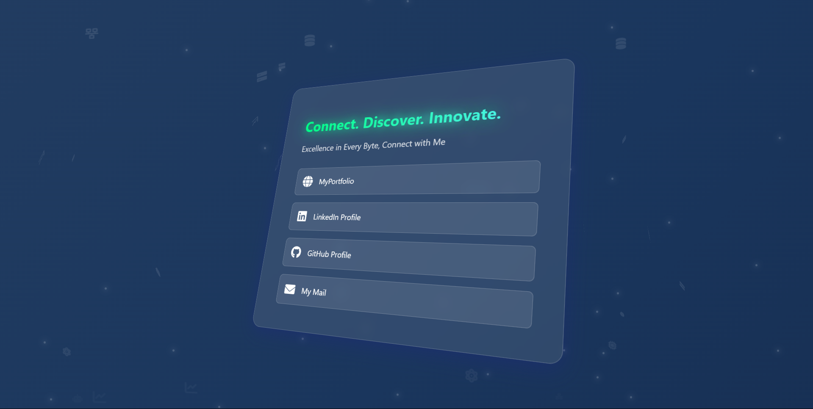

# ConnectWithMe 🌐

A modern and stylish contact links page to showcase your social media, portfolio, and other important links in a sleek and responsive design.

## 🚀 Features
- Fully responsive design 📱
- Modern and clean UI 🎨
- Easily customizable 🔧
- Smooth animations ✨

## 🛠️ Technologies Used
- HTML5
- CSS3
- JavaScript

## 📸 Preview


## 🔗 Live Demo  
👉 [Explore the website now!](https://anisbenini.github.io/conenctWithMe/) 🚀  

## 📌 How to Use
1. Clone the repository:
   ```sh
   git clone https://github.com/AnisBenini/conenctWithMe.git

## ⭐ Show Your Support
If you like this project, consider giving it a ⭐ on GitHub!
